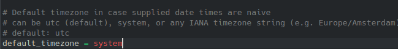

# Airflow

## Configuration

- Mettre tout ce qu'il y a dans le `/airflow` dans le repertoire `~/airflow` de votre pc
- Entrer dans le fichier `airflow.cfg` dans `~/airflow`
  - changer la `default_timezone` qui est par defaut defini sur `utc` en `system`
- cree un `.env` dans la racine airflow et mettet les variable necessaire

## Demarrage

- l'heure du lancement du dag donnee_2_rates_dag.py est cette ligne (`schedule_interval`):

- Donc change le avec ce qui vous convient quand vous tester

- Lancer les commande suivant:
  - nouveau session de terminal: `airflow scheduler`
  - autre session de terminal: `airflow webserver`

- acceder a la localhost sur le port 8080
- changer la date utc en date du serveur

## Fin

- normalement si tout marche bien, le dag se lance a l'heure que vous avez defini sur le `schedule_interval`
- et il y aura un fichier cree dans data apres l'execution
